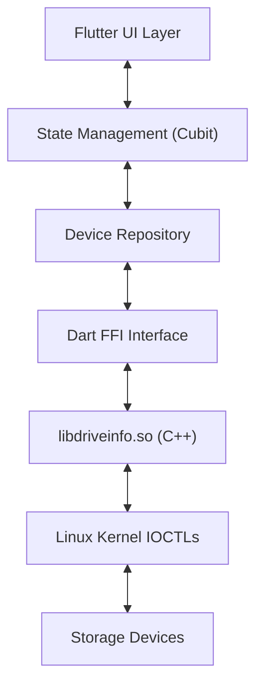

# FYP Report Draft: Swipe - Secure Data Sanitization Tool

## 1. Introduction
"Swipe" is a professional-grade data sanitization application built for Linux environments. It is designed to securely erase data from storage devices (HDD, SSD, NVMe) using internationally recognized standards (such as DoD 5220.22-M and NIST 800-88). Unlike simple formatting tools, Swipe ensures data is irretrievable, making it suitable for enterprise and security-critical use cases.

## 2. Technical Architecture

### 2.1 Technology Stack
- **Frontend**: Flutter (Dart) - Provides a responsive, modern, and touch-friendly user interface.
- **Backend**: C/C++ - A custom native library (`libdriveinfo.so`) handles low-level disk operations.
- **Integration**: Dart FFI (Foreign Function Interface) - Bridges the high-level UI with the low-level system commands.
- **Platform**: Linux (Ubuntu/Debian/Kali) - Leverages Linux kernel capabilities (sg_io, nvme-cli ioctls) for direct hardware access.

### 2.2 System Diagram

## 3. Key Features & Implementation

### 3.1 Secure Drive Detection
The application bypasses standard file system mounting and communicates directly with the kernel to identify all connected block devices. It retrieves:
- **Model & Serial Number**: For precise device identification.
- **Size & Media Type**: Distinguishes between SSDs (checking rotational flag) and HDDs.
- **Security Support**: Queries the drive firmware to check for ATA Secure Erase and NVMe Sanitize capabilities.

### 3.2 Sanitization Methods
Swipe implements multiple standardized algorithms:
1.  **Zero Fill**: Overwrites all addressable locations with zeros (Fast).
2.  **Random Data**: Uses cryptographically secure random number generators (CSPRNG) to overwrite data.
3.  **DoD 5220.22-M (3-Pass)**: A standard US military method involving multiple overwrite passes with verification.
4.  **Gutmann (35-Pass)**: An extensive overwrite method for legacy magnetic media.
5.  **ATA Secure Erase**: Triggers the drive's internal firmware command to wipe itself (Instant for many SSDs).

### 3.3 Audit & Reporting
A critical requirement for professional use is proof of erasure.
- **Certificate Generation**: Upon successful completion, the system generates a PDF certificate.
- **Content**: The certificate includes the device serial number, method used, timestamp, and result status.
- **Implementation**: Uses the `pdf` Dart package to dynamically layout the document and `printing` to save it.

## 4. User Interface Flow

1.  **Disclaimer (Root Check)**:
    - On startup, the app validates `root` privileges.
    - User must accept a liability waiver regarding permanent data loss.
    - *Safety Mechanism*: The app refuses to run without elevated privileges to prevent partial/failed operations.

2.  **Dashboard**:
    - Displays a real-time list of detected drives.
    - Icons indicate device type (HDD vs SSD).
    - Status badges show if "Secure Erase" is supported by firmware.

3.  **Wipe Configuration**:
    - User selects a drive and chooses a specific algorithm.
    - *Dynamic Options*: NVMe-specific options appear only for NVMe drives.

4.  **Progress & Verification**:
    - A circular progress indicator shows percentage, current pass number, and write speed (MB/s).
    - **Verification**: After wiping, the system can perform a read-back pass to confirm data is truly gone.

## 5. Security & Safety Mechanisms
- **Root Enforcement**: Prevents "Permission Denied" errors during critical I/O.
- **Selection Confirmation**: Requires explicit user confirmation before starting the destructive thread.
- **Thread Isolation**: The wiping process runs in a separate native thread (pthread) in C++, ensuring the UI remains responsive even during heavy I/O operations.

## 6. Conclusion
Swipe successfully bridges the gap between complex command-line wiping tools (like `dd` or `nwipe`) and user-friendly GUI applications. By combining the performance of C++ with the modern UX of Flutter, it provides a reliable, audit-ready solution for data sanitization on Linux.
